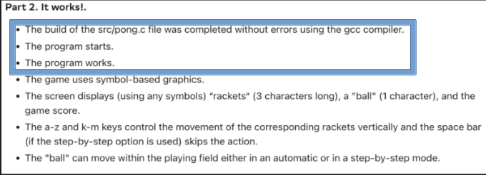

# FROM_STAFF_TO_PRODUCT

Данный файл содержит информацию про некорректные формулировки в групповых проектах интенсива, из-за которых возникают спорные ситуации на staff-проверках, а также решения как можно было бы решить эту проблему.

## Содержание

1. [Проблемы, касающиеся всех проектов](#проблемы-касающиеся-всех-проектов) \
    1.0. [Фото в applicant.21-school.ru](#0-фото-в-applicant21-schoolru) \
    1.1 [Флаг -fsanitize](#1-флаг--fsanitize) \
    1.2 [valgrind](#2-valgrind) \
    1.3 [leaks](#3-leaks) \
    1.4 [Системные библиотеки и вызовы (функции)](#4-системные-библиотеки-и-вызовы-функции) \
    1.5 [Функциональность проекта](#5-функциональность-проекта) \
    1.6 [Флаги](#6-флаги) \
    1.7 [Излишние пункты в ckecklist](#7-излишние-пункты-в-ckecklist) \
    1.8 [Ошибки cppcheck](#8-ошибки-cppcheck) \
    1.9 [exit()](#9-exit) 
2. [P01D06 Pong](#p01d06-pong) \
    2.1 [Указатели](#1-указатели) \
    2.2 [Массивы](#2-массивы) \
    2.3 [Бонусная часть](#3-бонусная-часть)
3. [P02D13 Game of Life](#p02d13-game-of-life) \
    3.1 [Преамбула](#1-преамбула) \
    3.1 [Количество строк](#2-количество-строк) \
    3.1 [Checklist. Part 3](#3-checklist-part-3)
4. [P03D20 Polish notation](#p03d20-polish-notation) \
    4.1 [Некорректная формулировка задания](#1-некорректная-формулировка-задания) \
    4.1 [Checklist. Part 2](#2-checklist-part-2) \
    4.1 [Checklist. Part 2](#3-checklist-part-2) \
    4.1 [Checklist. Part 3](#4-checklist-part-3)

## Пожелания

***Проекты интенсива не менялись с запуска сбер платформы. Многие задания есть в интернете с решениями и в принципе делают не равным обучение для тех, кто проходит интенсив не в первый раз. В связи с этим возникает предложение изменить задания бассейна, сделать новую историю и задания.***

***Задания экзамена, аналогично бассейну, не добавляются и не изменяются. Любое задание можно найти в интернете и в принципе попасть на репозиторий в гитхабе, где выложены ВСЕ задания экзаменов. Чтобы решить проблемы со списыванием предлагаем расширять пул заданий экзамена или использовать индивидуальные пакеты заданий для каждого интенсива. Можем предложить свою помощь для составления заданий экзамена, беря за основу либо задания с открытых ресурсов, либо свой опыт.***


## Проблемы, касающиеся всех проектов

  ### 0. Фото в applicant.21-school.ru
  #### Проблема:
  Перед началом проверки проверяющие должны идентефицировать пиров, которые приходят на проверку для того, чтобы убедиться, что проверяем именно тех пиров, которые заявлены в проверке.
  #### Возможное решение:
  - Исправить мобильную версию сайта, вернуть возможность проверять фото

  ### 1. Флаг -fsanitize
  #### Проблема:
  В репозиториях указана дополнительная проверка на корректную работу с памятью, которая указывает, что мы можем использовать fsanitize, но при использовании её на Mac в Москве выдает ошибку компиляции.

  
  *instructions_for_testing_rus.md*
  #### Предлагаемое решение:
  - Исправить компиляторы в кампусе.

  ### 2. valgrind
  #### Проблема:
  В репозиториях указано, что для проверки тестов на корректную работу с памятью можно использовать ***valgrind***, но его нельзя использовать на OS X и рекомендуется использовать утилиту ***leaks***. Но ***leaks*** показывает только утечки в памяти (непочищенную память) и не показывает ошибки работы с памятью (выход за границу массива, работа с неиницилизированными переменными), что не дает полноценно бассейнистам проверить проект, а на staff-проверках проверяющие используют ***valgrind***, разворачивая docker-контейнер для этой проверки.

  
  *instructions_for_testing_rus.md*
  #### Предлагаемые решения:
  - Добавить упоминание возможности использования виртуальной машины на ubuntu для использования ***valgrind***. Docker на многих машинах не работает, требует линковки на личных машинах, но позволяет быстрее развернуть окружение линукса. Возможно стоит рассказать про goinfre, дать скрипт линковки и инструкции в materials по настройке всего этого, чтобы пиры и стафф были в равных условиях.\
  Сам скрипт:
  ```
  rm -rf ~/Library/Containers/com.docker.docker
  mkdir -p ~/goinfre/Docker/Data
  ln -s ~/goinfre/Docker ~/Library/Containers/com.docker.docker
  reset
  ```

  ### 3. leaks
  #### Проблема:
  В *instructions_for_testing_rus.md* есть упоминание команды с `sudo`, которая априори не будет работать на машинах в кампусах. Пиры обращаются к волонтерам с просьбой помочь, на что они получают ответ, что у них нет прав, в свою очередь они задаются вопросом зачем тогда про это пишется.

  
  *instructions_for_testing_rus.md*
  #### Предлагаемые решения:
  - убрать упоминание sudo

  **ИЛИ**

  - проверить маки на корректность работы leaks, чтобы надобности в инструкции не было

  ### 4. Системные библиотеки и вызовы (функции)
  #### Проблема:
  Cистемные вызовы обращаются напрямую к ядру системы и не являются безопасными, они уменьшают портируемость программ т.к. на разных ОС вызовы могут отличаться своей работой, либо не позволят скомпилировать код. Пиры часто приходят с кодом, который содержит вызов такого вида: `system("clear")`, `exit(0)`. Они говорят, что запрета на использование этих вещей нет, возникает много споров между проверяющими и пирами, проверяющие все равно ставит флаг, а у пиров портится впечатление.

  #### Предлагаемые решения:
  - Добавить запрет на использование системных вызовов (system() и ему подобные, библиотеки sys/*.h, exit()) в ридми всех проектов.

  ### 5. Функциональность проекта
  #### Проблема:
  Проверяющие иногда встречаются с такими проектам, которые компилируются, запускаются и не выполняют даже минимальные требования к проекту (например, есть только отрисовка поля или вывод нескольких графиков) или в принципе ничего не выполняют. Если выставлять оценки согласно чеклисту, то пиры получают какие-то минимальные баллы и зеленый проект.
  Пример: пришла команда, у которой фактически нет алгоритма Дейкстры. Максимум, строка на лексемы парсится. Однако, в части отрисовки они всегда рисуют график функции sin(cos(2x)). То есть, при любом вводе программа выводит данный график. По checklist это проходит все, кроме одного, пункты в Part 1, но также проходит и все пункты в Part 2 кроме последнего. Пункта, который проверяет корректность сборки и работы программы. За такую программу команда получает 4/4/0 и зеленый проект, согласно checklist.

  #### Предлагаемые решения:
  - Добавить отдельный флаг за нефункциональность проекта.
  
  **ИЛИ** 

  - Изменить чеклисты.

  ### 6. Флаги
  #### Проблема:
  Флаг "**forbidden function**" выдает подсказку "использование запрещенных библиотек и функций", что вызывает спорные ситуации, когда пиры видят эту самую подсказку. Например, такого рода: "Указатель — это не функция, а оператор! Почему я получаю этот флаг?".

  #### Предлагаемые решения:
  - Изменить флаг "**forbidden function**" на "**forbidden syntax**" и поменять его описание.

  ### 7. Излишние пункты в ckecklist
  #### Проблема:
  Во всех чеклистах указаны пункты: исходный код программы проходит проверки на стиль и статический анализатор. За непрохождение этих проверок, согласно правилам Школы, проверяющие должны ставить флаг style, а не снижать оценку, поэтому эти пункты излишни в чеклисте.
  То же касается пунктов `the program starts`, `the program works`, `build ... was completed without errors using gcc compiler`, за которые ставятся флаги **Crash** и **Invalid Compilation** соответственно.

   
  
  *checklist P01D06*
  #### Предлагаемые решения:
  - Убрать пункты чеклиста про стиль, статический анализатор и сборку программы из чеклистов.

  ### 8. Ошибки cppcheck
  #### Проблема:
  Cppcheck иногда выдает некорректные ошибки (always true condition), поэтому лог cppcheck явно не критерий для оценки.

  #### Предлагаемые решения:
  - Стоит внести в materials критерии вроде "variable declaration without definition", "the scope of a variable can be reduced" и т.д., на которые cppcheck корректно указывает, чтобы пиры проверяли в первую очередь их.

  ### 9. exit()
  #### Проблема:
  exit() является незначительно более мягким аналогом goto(), который несет в себе много потенциальных ошибок и грубо нарушает принципы структурного программирования. Однако, exit() явно не упоминается в файле "7 principles of structural programming" и/или в README.md проектов. Поэтому трудно обосновать выставление флага **Forbidden function**, не смотря на то, что использование exit() отлично подходит под его определение.

  #### Предлагаемые решения:
  - Стоит внести упоминание exit() в следствия в файле "7 principles of structural programming".

## P01D06 Pong

  ### 1. Указатели
  #### Проблема:
  В условиях проекта указано, что пирам нужно выполнить проект в рамках изученного материала. Предполагается, что проекты не должны содержать функции, параметры которых содержат указатели. Но пиры говорят, что они использовали указатели в рамках выполнения *T04D04 Quest 2* (в данном квесте используются указатели для параметров командной строки). Из-за этого возникают долгие споры между пирами и проверяющим.

   
  *T04D04/README_RUS.md*
  
   
  *P01D06/README_RUS.md*
  
  #### Предлагаемые решения:
  - Изменить *T04D04 Quest 2*, например, перенести параметры командной строки во входные данные, так как там используются указатели и строки, которые пир проходят только на 2 и 3 неделях соответственно. 
  
  **И**
  
  - Добавить явный запрет на использование указателей в раздел "**Важные замечания**" в *P01D06/README_RUS.md*.

  ### 2. Массивы
  #### Проблема:
  В условиях проекта указано, что пирам запрещено использовать динамическую память, но как такового запрета на использование массивов нет. Также пиры частенько трактуют, что массивы это не указатели, так как массив объявляется `int data[25][80]`, а указатели `int *data`.

   
  *P01D06/README_RUS.md*

  #### Предлагаемые решения:
  - Добавить явный запрет на использование массивов в раздел "**Важные замечания**" в *P01D06/README_RUS.md*.

  ### 3. Бонусная часть
  #### Проблема:
  В условиях бонусной части бассейнистам разраешается использовать дополнительные библиотеки для упрощения обработки действий игроков и отображения символьной графики. 
  
   
  *P01D06/README_RUS.md*

  Проверяющие часто сталкиваются с кодом, который содержит структуры, битовые операции и пр, например:
  ```
  struct termios t;
  tcgetattr(STDIN_FILENO, &t);
  t.c_lflag &= ~(ICANON | ECHO);
  tcsetattr(STDIN_FILENO, TCSANOW, &t);
  ```
  Этот код пиры толком не могут объяснить, почти всегда говорят: "Ну, в интернете увидели такую штуку, поэтому вставили её. Что это значит объяснить не можем". Так как они не могут объяснить этот код приходится ставить флаг cheating.

  #### Предлагаемые решения:
  - Изменить формулировку на: *"...используя **функции из дополнительных библиотек** для..."*.
  
    **ИЛИ**

  - Разрешить только библиотку ncurses.h.


## P02D13 Game of Life
  ### 1. Преамбула
  #### Проблема:
  Явно не прописано, какие библиотеки разрешено использовать для смены скорости в интерактивном режиме. Тогда как в README_RUS.md проекта нет обычной приписки, что разрешено использовать только пройденные ранее синтаксические конструкции и/или функции из стандартных библиотек.
  
   
  *checklist P02D13*

   
  *P02D13/README_RUS.md*

  #### Предлагаемые решения:
  - Вернуть стандартную преамбулу про использование только изученного материала.
  
    **И**

  - Разрешить ncurses.h и разрешить freopen или другие функции переоткрытия потока.
  
    **ИЛИ**
  
  - Разрешить использовать **только** time.h для интерактивного ввода, так как проект **P02D13 Game of Life** оказывается, в итоге, легче чем **P01D06 Pong** из-за того, что применяются те же решения.

  ### 2. Количество строк
  #### Проблема:
  В условии задания, чеклисте, принципах структурного программирования указаны разные числа для ограничения количества строк.


   
  *checklist P02D13*

   
  *7 principles of structural programming.md*

   
  *P02D13/README_RUS.md*
  #### Предлагаемые решения:
  - Исправить формулировку в чеклисте.

  ### 3. Checklist. Part 3
  #### Проблема:
  Пункт `there is an option to finish the game`. Несоответствие этому пункту подразумевает единственным способом завершения программы C^D, что подразумевает выставление флага **Crash**.

   
  
  *P02D13 checklist*

  #### Предлагаемые решения:
  - Заменить данный пункт в checklist на `game finishes when a loop is formed`.

## P03D20 Polish notation
  ### 1. Некорректная формулировка задания
  Программа работает с "произвольными выражениями" и, при этом, "ничего кроме графика выводить не нужно". Например, выражение "()", которое состоит из разрешенных в математических выражениях операторов, не имеет графика. Равно как и любая другая скобочная последовательность. Учитывая же размытость формулировки, то выражением вполне может быть и "asdascxz", которое графика тоже не имеет.
  
   
  *P03D20/README_RUS.md*

  #### Предлагаемые решения:
  - Прописать, что в случае некорректного ввода выводить на экран "n/a".

  ### 2. Checklist. Part 2
  #### Проблема:
  Согласно инструкции для staff-проверок, за каждое несоответствие пункту checklist снимается как минимум 1 балл (за исключением Part 3). Это позволяет проверять практически единообразно проекты, вне зависимости к какому проверяющему попалась команды. Часто бывает, что программа обрабатывает только половину выражения (либо не обрабатывает их вовсе), однако проверяемые теряют за это фактически всего один балл. 

   
  *checklist P03D20*

  #### Предлагаемые решения:
  - Декомпозировать последний пункт.
  
  **И/ИЛИ**

  - Декомпозировать все остальные пункты кроме последнего, потому что отрисовка является менее значимой частью проекта, нежели парсинг, вычисления и корректная работа алгоритма.

  **И/ИЛИ**

  - Вынести оценку отрисовки отдельно от оценки правильности вычислений.

  ### 3. Checklist. Part 2
  #### Проблема:
  Судя по переходу шрифта от прямого к курсиву здесь точно были звёздочки умножения, которые как-то превратились в форматирование текста.

  
  *checklist P03D20*

  #### Предлагаемые решения:
  - Исправить опечатку.

  ### 4. Checklist. Part 3
  #### Проблема:
  Непонятно, что значит "correctly handles"? Выводит пустой график, говорит об ошибке, завершается корректно?

   
  *checklist P03D20*

  #### Предлагаемые решения:
  - Уточнить формулировку в чеклисте.